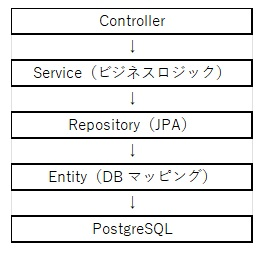
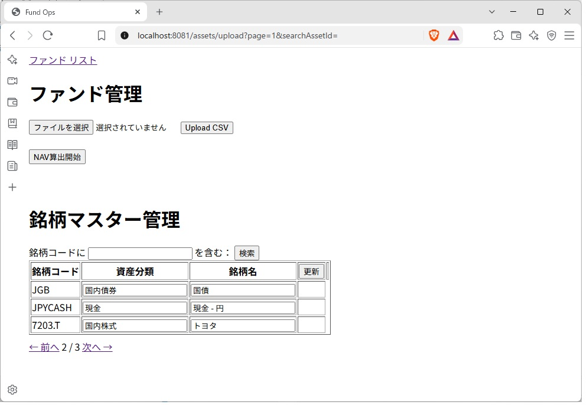

Web API開発で主流となっているSpring Bootの中に Spring Batchという機能があるのに興味を持ち、どのように実際の業務処理に適用できるか知りたくなりました。今回は投資信託の基準価額計算を題材として開発を試みました。 
また、Javaの解説書のなかではあまり取り上げられることのないデータ型 BigDecimal についても、経験値をあげたく開発のなかで取り組みました。
 
 
# 1. 実務要件
今回の開発では、以下の実務要件を満たすように設計しています。 
(a) 資産データの数量・価格は日々変動し、外部CSVデータとしてインタフェースできること 
(b) 同一日でも「約定通知遅延」「価格修正」が発生するため、資産データは日中でも上書き更新（UPSERT）できること 
(c) 計算されたNAV、基準価額は日次で蓄積され、Webより履歴が参照可能なこと 
(d) またファンド管理用Webから、CSVデータの取り込み、基準価額計算の起動が可能なこと 
(e) 基準価額はスケジュール起動も可能とすること 
 

# 2. アーキテクチャ構成 
Spring Boot の標準的なレイヤー構造を採用し、保守性・拡張性の高い設計になっています。 
 

 

# 3. 使用技術 
|カテゴリー|技術|
|-------------|---------------------------|
|Backend|Spring Boot 4.1.0|
|ORM|Spring Data JPA / JDBC|
|Batch|Spring Batch|
|DB|PostgreSQL|
|Build|Maven|
|Language|Java 17|
|Logging|SLF4J / Logback|
|Testing|JUnit 5, Mockito|
|Others|CSV Import, Composite Key, UUIDv7, Thymeleaf|
 

# 4. Entity構造 
(a) Fund（ファンド）
- ファンドの基本情報
- NAV、口数、基準価額の最新を保存
- Asset 及び FundNavHistory と(1:N)で紐付け

(b) FundNavHistory（基準価額履歴）
- 基準価額、NAV、口数を日次で保存
- NAV 計算時に自動で UPSERT
- Fund と紐付け

(c) Asset（資産）
- 複合主キー（fund_id, nav_date, asset_id）で保存
- 同一日・同一資産でも価格修正や約定通知遅延があるため、Upsert で更新
- Fund と紐付け

(d) AssetMaster（銘柄マスタ）
- 主キー: UUIDv7、ユニークキー: 銘柄コードで保存
- 銘柄コード、資産分類、銘柄名を保存
- Asset（資産）更新後、銘柄マスタに存在しない銘柄コードがあれば自動で追加

 

# 5. CSV インポート（UPSERT） 

CSV をアップロードすることにより、Asset(資産)データを取り込んでいます。 
 
(a) 特徴 
Upsert による更新のため約定通知遅延や価格修正に対応
   - 同じ (fund_id, nav_date, asset_id) が存在する場合  →  UPDATE     
   - 存在しない場合   →   INSERT
        
(b) 処理の流れ
Spring Batch の Chunk モデルを使用し、以下の処理を実装
   - JobOperator: /assets/upload (POST) により Batch 起動
   - ItemReader: Asset(資産)とFund 投信口数を CSVデータから取り込み
   - ItemProcesser: データベース格納用の Javaクラスに変換
   - ItemWriter: 変換後の Javaクラスを、JDBCによりデータベースに格納
   - JobListener: Batch終了のステータスを画面に転送、銘柄マスタAssetMasterに新規銘柄を自動追加

 
 

# 6. 基準価額計算 
Spring Batch の Taskletモデルを使用し、JPAにより以下の処理を実装しています。 
(a) ファンドの資産をすべて取得 
(b) NAV、口数、基準価額を算出
(c) FundNavHistory に保存（UPSERT） 
(d) Fund（ファンド）のNAV、口数、基準価額を最新に更新 
(e) ログ出力で計算過程を記録 
またデータ型 BigDecimal を用いることにより丸め誤差による精度落ちに対応しつつ、端数切捨て・ゼロ判定にも対応
 
 

# 7. 画面一覧 

|画面|パス|メソッド|備考|
|-------------|---------------------------|---------------------------|---------------------------|
|ファンド管理 - Upload CSV|/assets/upload|POST|[Upload CSV] ボタンより起動||
|ファンド管理 - NAV算出開始|/nav/start|POST|[NAV算出開始] ボタンより起動|
|銘柄マスター管理|/assets/upload|GET|銘柄マスターリストを表示|
|ファンド開示 - ファンド一覧表|/funds|GET|上記のリンク [ファンドリスト] より展開|
|ファンド開示 - ファンド詳細|/funds/{Id}|GET|	上記のリンク[詳細] - [開く] より展開|

 
 

# 8. 実行方法

(a) PostgreSQL を起動

-　環境変数に DB ユーザー名・パスワードを設定：

            export DB_USER=your_user
   
            export DB_PASS=your_pass

(b) Spring Boot を起動

            ./mvnw spring-boot:run
 

# 9. セキュリティ 
以下の通りDBパスワードを直接 application.properties 内に設定せず、ユーザー環境変数を参照しています。

            spring.datasource.username=${DB_USER}
            spring.datasource.password=${DB_PASS}
 

# 10. 今後の拡張予定 
今後、追加したい機能です。 
- チャート表示（Chart.js）
- 資産分類別の投資比率円グラフ表示（Chart.js）
- JSON形式のデータ開示用 Web APIの追加
 
 

# 11. 画面イメージ
 

### 画面 [ ファンド管理 / 銘柄マスター管理 ]

銘柄マスターに新規追加されるたび「銘柄マスター管理」の表示件数が増加するため、ページネーションで対応。 
銘柄マスターに存在しない銘柄コードはCSVより自動で追加されますが、資産分類や銘柄名は画面より登録が必要です。 
画面に表示されている銘柄コードに対し、登録・変更を行ったあと [更新] ボタンで一括で処理可能です。 

### 画面 [ ファンド開示 - ファンド一覧表 ]
 

### 画面 [ ファンド開示 - ファンド詳細 ]
履歴が保存されるにたび「基準価額推移」の表示件数が増加するため、ページネーションで対応。 

 

# 12. 工夫した点・苦労した点

- 金融計算における精度の担保（BigDecimal） 
   基準価額や口数の計算において丸め誤差を出さないよう、安易に double を使わず BigDecimal で統一しました。ゼロ除算のハンドリングや端数処理の指定など、実務を意識した設計を意識しました。

- 日中のデータ修正・約定遅延への対応（UPSERT） 
   同じ日・同じ資産でも価格修正等でデータが再送されてくるケースを想定し、複合主キーによる UPSERT 処理をバッチ内に組み込み、データの重複を防ぐ構成にしました。

- 画面の使い勝手とページネーション  
   履歴やマスタのデータ増加に対応するため Spring Data の Pageable を導入しました。更新前後のページ間で齟齬が無いよう、リダイレクト時のパラメータ引き継ぎなど画面遷移の整合性にも配慮しました。

 

# 13. CI/CD

